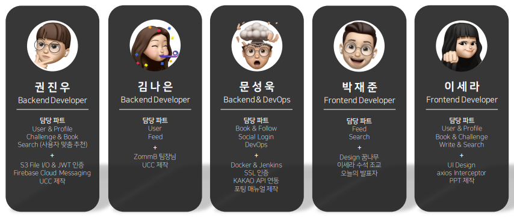
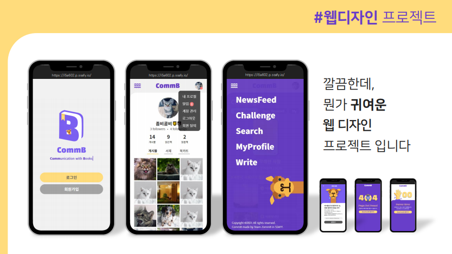
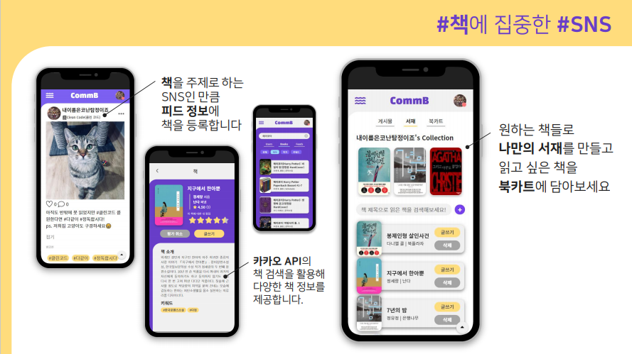

# CommB 📚

> Vue와 SpringBoot를 활용한 독서 관련 웹 SNS 개발 공간입니다.

## 🌈 About

- 개발 언어

  - Vue.js 2.6.11 | vue/cli 4.5.0
  - Springboot 2.5.2 | Gradle 6.8.3

  

- 팀원 정보 및 업무 분담

  


## 🌟 Overview

- **Comm**unication with **B**ooks

  - '책'을 중심으로 소통하는 웹 SNS 프로젝트

  

## 🚀 Service

#### 1. 모바일 사이즈에 집중한 웹 디자인

- CommB는 모바일 사이즈를 기반으로 개발된 웹 SNS입니다.

  - 기존 SNS 플랫폼의 깔끔한 UI에 CommB만의 귀여운 포인트를 더해 UI 디자인을 진행했습니다.

  

  

#### 2. 다양한 책 정보와 관련 기능

- 카카오 책 검색 API와의 연동을 통해 다양한 책 정보를 제공하며, 책과 관련한 여러 기능을 이용할 수 있습니다.

  1. 피드 작성 시, 게시물과 연관된 책을 등록할 수 있습니다.
  2. 카카오 책 검색 API를 사용하여 다양한 책 정보를 열람할 수 있습니다.
     - CommB에서 책을 검색할 경우, 카카오 API와의 통신을 통해 책 정보를 제공합니다. 이때, CommB DB에 없는 책일 경우 자동으로 DB에 추가하도록 로직을 구현했습니다.
  3. 프로필 페이지에서 서재와 북카트 탭을 활용할 수 있습니다.
     - 본인이 읽은 책을 서재에 추가할 수 있으며, 그 중 마음에 드는 책을 상단 컬렉션 바에 추가할 수 있습니다. 
     - 읽고 싶은 책이 생기며 북카트에 추가해 목록을 볼 수 있습니다.

  


#### 3. 꾸준한 독서 권장을 위한 챌린지

- 사용자들의 꾸준한 독서를 권장하기 위해 위클리/데일리 챌린지를 운영합니다.

  - 위클리 챌린지에서는 매주 새로운 책을 추천합니다. 해당 책을 주제로 작성한 피드는 하단에 표시되어 피드 내용을 볼 수 있습니다.
  - 데일리 챌린지에서는 매일 새로운 키워드를 추천합니다. 해당 키워드를 태그로 등록한 피드는 하단에 표시되어 피드 내용을 볼 수 있습니다.
  - 내 챌린지 페이지를 통해 챌린지 수행 여부를 확인할 수 있으며, 그에 따라 챌린지 뱃지가 조정됩니다. 뱃지는 프로필에 표시할 수 있도록 디자인했습니다.

  


<br><br>


## Git RULEs

> 반드시 현재 브랜치를 확인하는 습관!!!!
>
> 아래 내용이 매우 복잡해 보일 수 있지만, 여기까지가 협업에서의 **최소 능력 조건**입니다. 

1. `$ git switch master` 로 master 브랜치로 이동 후, `$ git pull origin master` 를 통해 master 브랜치 업데이트

   ```sh
   (브랜치 상관 없음)
   $ git switch master
   (master)
   $ git pull origin master
   ```

2. `$ git switch -c <개발 중인 기능명>` 으로 새로운 브랜치 생성 후 이동

   ```sh
   (master)
   $ git switch -c <기능명>
   
   (기능명)
   $ 
   ```

3. 작업 후 커밋 규칙

   ```sh
   (기능명)
   $ git status # 작업 목록(변경된 부분) 확인
   $ git add <파일 or 폴더>  # 작업 목록에서 세분화할 수 있으면 git add .(전체) 이 아닌 파일 단위로 add
   $ git commit -m '[#JIRA CODE] 태그: 간단한 설명'
   ```

   - 태그 종류

     | 태그             | 설명                                                         |
     | ---------------- | ------------------------------------------------------------ |
     | Feat             | 새로운 기능을 추가할 경우                                    |
     | Fix              | 버그를 고친 경우                                             |
     | Design           | CSS 등 사용자 UI 디자인 변경                                 |
     | !BREAKING CHANGE | 커다란 API 변경의 경우 (ex API의 arguments, return 값의 변경, DB 테이블 변경, 급하게 치명적인 버그를 고쳐야 하는 경우) |
     | !HOTFIX          | 급하게 치명적인 버그를 고쳐야하는 경우                       |
     | Style            | 코드 포맷 변경, 세미 콜론 누락, 코드 수정이 없는 경우        |
     | Refactor         | 프로덕션 코드 리팩토링, , 새로운 기능이나 버그 수정없이 현재 구현을 개선한 경우 |
     | Comment          | 필요한 주석 추가 및 변경                                     |
     | Docs             | 문서를 수정한 경우                                           |
     | Test             | 테스트 추가, 테스트 리팩토링(프로덕션 코드 변경 X)           |
     | Chore            | 빌드 태스트 업데이트, 패키지 매니저를 설정하는 경우(프로덕션 코드 변경 X) |
     | Rename           | 파일 혹은 폴더명을 수정하거나 옮기는 작업만인 경우           |
     | Remove           | 파일을 삭제하는 작업만 수행한 경우                           |

   

4. `$ git push origin <브랜치 이름(== 기능명)>` 으로 푸시

   ```sh
   (기능명)
   $ git push origin <기능명>
   ```

   

5. GitLab 에서 우측 상단에 `create merge request` 버튼을 클릭한다.

   - Develop 브랜치로 머지해서 test하고 master로 옮길 건가?

   

6. merge request 는 본인이 하지 않기 ^^

   - 머지하면 해당 브랜치 삭제할 건지 정하기


#### Git 사용이 익숙하지 못할 경우

> 본인 브랜치 Merge 끝나면 local에서 브랜치 삭제하고 새로 생성하는 게 편하긴 함.. 이건 알아서 ^^

1. 아래 과정을 통해 기존 브랜치는 삭제한다.

   ```sh
   (기능명)
   $ git switch master
   
   (master)
   $ git pull origin master  
   $ git branch -d <기능명>
   ```

   이때, 아래와 같이 2가지 경우가 나타난다.

   1. `origin/master` 에 본인 push 내용이 merge가 완료된 경우.

      ```sh
      (master)
      $ git branch -d <기능명>
      Deleted branch <기능명> (was 5b7ef2a).
      ```

   2. 아직 `origin/master` 에 merge 되지 않았을 경우 => merge 담당자에게 요청.

      ```sh
      (master)
      $ git branch -d <기능명>
      error: The branch '<기능명>' is not fully merged.
      If you are sure you want to delete it, run 'git branch -D <기능명>'.
      
      # 담당자의 merge 완료 이후
      (master)
      $ git pull origin master  # 아래와 달리 conflict 단어가 나온다면 local에서 해결할 수 있긴 한데, 잘못하면 남의 코드 다 날릴 수도 있답니다. 불안하면 팀에 공유하기 
      Enumerating objects: 8, done.
      Counting objects: 100% (8/8), done.
      Delta compression using up to 12 threads
      Compressing objects: 100% (6/6), done.
      Writing objects: 100% (6/6), 234.89 KiB | 26.10 MiB/s, done.
      Total 6 (delta 0), reused 0 (delta 0), pack-reused 0
      To https://lab.ssafy.com/05/seoul04/aps_hub.git
         448c2fe..1b01385  master -> master
      
      $ git branch -d <기능명>
      Deleted branch <기능명> (was 5b7ef2a).
      ```
      
   3. 다시 처음으로 돌아가 브랜치 만들고 시작
